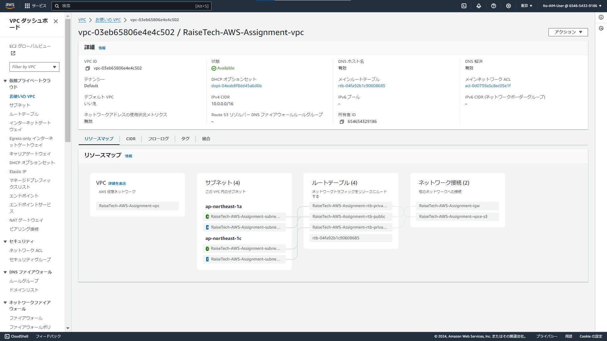

# 第四回課題

## 新しいVPCの作成
  

## EC2の構築
 

 

・EC2セキュリティグループ
 

## RDSの構築
 

 

## RDSのセキュリティグループ
 

 

## EC2への接続とEC2からRDSへの接続
 

### 第四回課題に取り組んでの感想
最初はEC2への接続が上手くいかなかった原因が作成時のネットワーク関連設定の項目でVPCがデフォルトのままだったり、
RDS データベース とEC2 インスタンスの接続セットアップをしなかったことでEC2からRDSへの接続が上手くいかなかったりと初歩的なミスが多かったと感じた。
初歩的なミスが多い→学ぶことが多い→伸びしろが大きい！と前向きに捉えて、学習を頑張ろうと思った。
